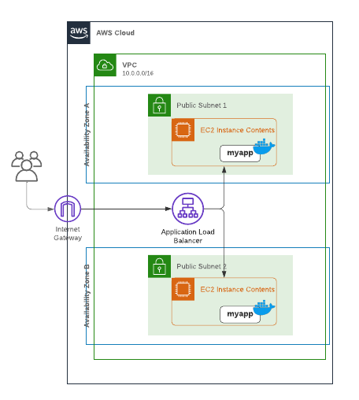
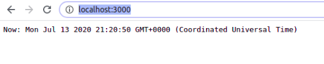

# lab-aws-dockermachine
> Este laboratório demonstrar como fazer deploy de container, em instância AWS EC2, com o utilitário docker-machine e como preparar o ambiente para alta disponibilidade utilizando um Load Balance. 


## Requisitos
1. Deve ser gerada imagem docker com a aplicação rodando na porta 3000.
2. As instâncias EC2 serão criadas e configuradas pelo docker-machine.
3. O Load Balance será do tipo Application Load Balance direcionando todo o tráfego da porta 80 para as instâncias na porta 3000.
4. As instâncias não podem expor os serviços direto para a internet.
5. Ambas as instâncias irão rodar na região “us-east-1”
6. Deverá rodar uma instância na availability zones us-east-1a e outra na us-east-1b. Garantindo a alta disponibilidade.

## Design final da solução




## Configurações

Ferramentas necessárias para o laboratório:
- [node.js 10+](https://nodejs.org/en/download/)
- [yarn](https://classic.yarnpkg.com/en/docs/install/) para gerenciar as dependências (também pode ser utilizado o npm).
- [docker](https://docs.docker.com/engine/install/)
- [docker-machine](https://docs.docker.com/machine/install-machine/)
- [aws-cli](https://docs.aws.amazon.com/cli/latest/userguide/install-cliv2.html)

## Criar a aplicação node.js
Para este laboratório será criado uma aplicação simples, desenvolvida em node.js, que irá conter dois endpoints um para health check e o outra será funcionalidade que ao chamar o endpoint retorno a data e hora atual.

Para criar o projeto, o primeiro passo é criar o diretório e depois acessá-lo:
```sh
mkdir lab-aws-dockermachine
cd lab-aws-dockermachine
```  

Agora precisamos criar o arquivo package.json, fazemos isso com o comando: 
```sh
yarn init
```
Após responder as questões o aquivo será criado.
Agora precisamos instalar o express:

```sh
yarn add express
```

Abra seu editor/IDE favorita. Apontando para o diretório do projeto.
Para essa aplicação vou criar um único arquivo chamado index.js.
Abaixo como ficou o código:
```javascript
const express = require('express')

const app = express();

app.get('/health', (req, res) => res.send("ok"));
app.get('/', (req, res) => res.send("Now: "+ new Date()));

app.listen(3000);
```

Uma rápida explicação do código:

....

Também alterei o package.json, adicionando um scritp para start da aplicação:

```json
…
 "license": "MIT",
  "scripts": {
    "start": "node index.js"
  },
...
```
Assim para rodar a aplicação é só digitar ``` yarn start ```.

Abaixo como ficou a estrutura do meu projeto:

 


## Criar o Dockerfile.

O Dockerfile é um arquivo texto que contém os comandos utilizados pelo Docker para gerar a imagem, isso inclui instalação de pacotes, criação de diretórios e definição de variáveis de ambiente entre outras coisas. 

Conteúdo do Dockerfile:

```Dockerfile
FROM node:10-alpine

WORKDIR /usr/app
COPY package.json yarn.lock ./

RUN yarn

COPY . .

EXPOSE 3000
CMD ["yarn", "start"]
```

Explicando o arquivo:….

Para aumentar o desempenho da compilação, exclua arquivos e diretórios adicionando um .dockerignore no diretório raiz. 
Criei um .dockerignore com o diretório node_modules.


## Build da aplicação e gerando a imagem docker

Para gerar a imagem, basta digitar:


```sh
docker build -t myapp .
docker run -d -p 3000:3000 myapp
```


## Testando local.

Para testar abra o browser e digite: http://localhost:3000/ se tudo estiver correto deve retornar a data e hora:

 

Para testar o health, no browser, digite ``` http://localhost:3000/health``` Deve retornar “ok”:

 

## Criando as instâncias com docker-machine

```sh
docker-machine create --driver amazonec2 --amazonec2-open-port 3000 --amazonec2-region us-east-1 --amazonec2-zone a aws-myapp-a
docker-machine create --driver amazonec2 --amazonec2-open-port 3000 --amazonec2-region us-east-1 --amazonec2-zone b aws-myapp-b
``` 

Serão criadas duas instâncias na AWS:
 

Támbem será criado um Security Group com o nome docker-machine:
 

## Configurando e subindo a aplicação

Para configurar o docker local apontando para a instância EC2 digite:
```sh
docker-machine env aws-myapp-a
```

Será apresentada as variáveis que devem ser configuradas, para poupar esforço é possível fazer tudo apenas com o comando:

```sh
eval $(docker-machine env aws-myapp-a)
```
A partir de agora todo o comando docker será executado na instância EC2. Então bora subir nosso conteirer, para isso é so repetir os comando feitos para rodar local:

```sh
docker build -t myapp .
docker run -p 3000:3000 myapp -d
```
Pronto o contêiner já está rodando com a aplicação, para provar isso vamos fazer um teste chamando a aplicação. Primeiro vamos descobrir qual o ip público da instância com o comando:
```sh
docker-machine ip aws-myapp-a
```

No meu caso foi “3.87.154.248” agora abra o navegador e digite http://3.87.154.248:3000/


Agora é preciso subir a aplicação da outra instância, abra outro terminal e digite  os comandos:

```sh
eval $(docker-machine env aws-myapp-b)
docker build -t myapp .
docker run -d -p 3000:3000 myapp
docker-machine ip aws-myapp-b
```


Resumos até aqui:
Duas instâncias, cada uma em uma AZ, rodando a aplicação exposta na porta 3000.
Os próximos passos são:

-Configurar um load balance
-Alterar o Security Group das instâncias para permitir conexões na porta 3000 apenas originadas do Load Balance.

## Configurando Load Balance


## Ajustando o Security Group das instâncias.

Para atender o requisito 4 devemos ajustar o Security Group das instâncias para permitir conexões na porta 3000 apenas originadas do Load Balance.  


Assim só é possível chegar ao serviço utilizando o Load Balance.


